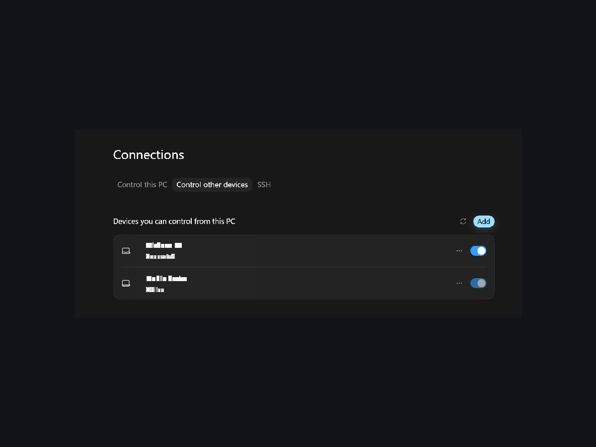
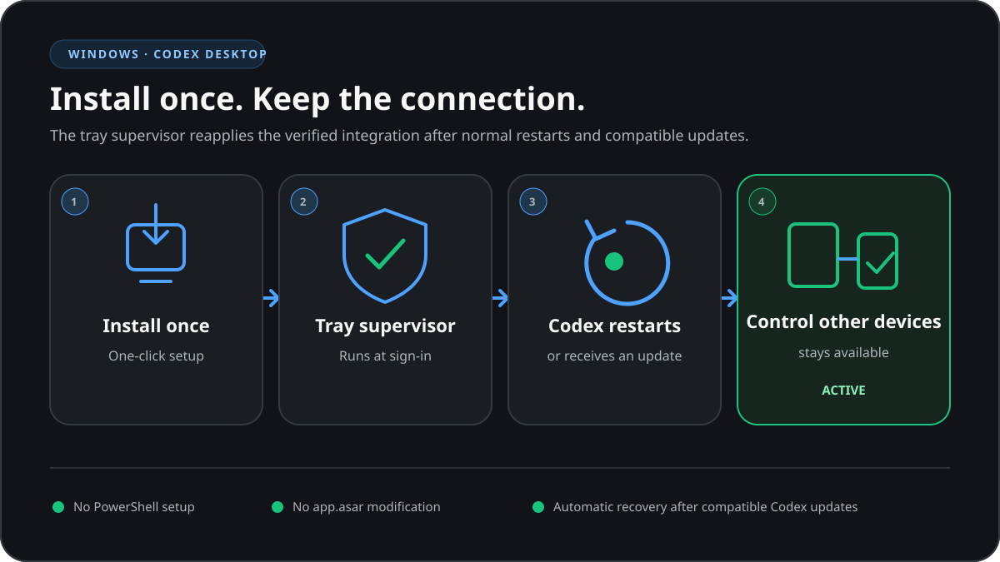
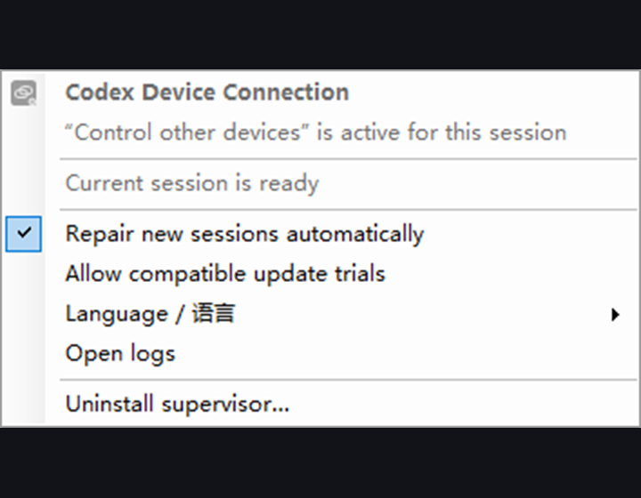

# CodexRemote-fix

Language / 语言: English · [简体中文](README.zh-CN.md)

CodexRemote-fix enables the UI that ships with Codex Desktop for Windows but is hidden by a runtime defect:

**Settings → Connections → Control other devices**

This project does not modify `ChatGPT.exe`, `app.asar`, or anything under
`C:\Program Files\WindowsApps`. After installation, a persistent tray supervisor
manages everything automatically.

> [!IMPORTANT]
> Complete the MFA, SSO, or passkey checks required by your account or workspace before enrolling a device.

> [!WARNING]
> This is an unofficial runtime compatibility project. It enables Chromium debugging on a random
> `127.0.0.1` port. Run it only on a trusted Windows machine, and re-run the compatibility check
> after every Codex update.

## Quick start

1. Download `CodexRemote-fix-2.4.2-setup.exe` and `CodexRemote-fix-2.4.2-setup.exe.sha256.txt` from the [Releases](https://github.com/naipi11/Codex-Control-other-devices-Windows/releases) page, then verify the SHA-256.
2. Run `CodexRemote-fix-2.4.2-setup.exe`; no administrator rights are required.
3. The tray supervisor starts automatically and creates the desktop shortcut **CodexRemote-fix**. When the tray icon is green, open **Settings → Connections → Control other devices** to enroll or use the device.



*Example screen; account, device, and environment details have been removed.*

The current installer and its SHA-256 checksum are always published on the
[Releases](https://github.com/naipi11/Codex-Control-other-devices-Windows/releases) page.

To upgrade, run the new installer over the previous installation. Existing settings and device
keys are preserved. The installer also replaces a legacy supervisor that did not record its
session state, including one left behind by an earlier interrupted upgrade, so a restart is not
needed after upgrading.

Verified on Windows 11 · Codex Desktop `26.803.10989.0` · Node.js `22.23.1`:
the tab, controller enrollment, device list, and remote projects are all working.

## Everyday use



*Illustration; simplified for readability.*

- The logon task `Codex Control Other Devices Supervisor` starts the tray supervisor automatically; no manual steps are needed.
- The desktop shortcut **CodexRemote-fix** is an optional way to start the tray supervisor if its icon is not visible. It does not start a repair or change a Codex session by itself.
- A green tray icon means the current session is active. Open **Settings → Connections → Control other devices** to enroll or use it.
- New Codex builds start with `--remote-debugging-port` but no `--inspect`; the supervisor recognizes that launch shape and performs the takeover automatically.
- The tray menu supports Follow system, Chinese, and English; switching applies immediately without restarting anything.
- Updating this project or Codex does not require reinstalling the supervisor; the installer atomically switches versioned runtimes.
- If an explicit repair is needed, Codex may close and relaunch once. Use **Retry last repair** from the tray menu; existing device pairing and authorization are preserved. A completed recovery left behind by an interrupted upgrade is cleared safely on the next supervisor start.

## Releases

Every tagged release ships a Windows installer and its SHA-256 checksum as release assets.
The `.github/workflows/release.yml` workflow builds the installer from the tag automatically,
so the 2.4.2 release includes the ready-to-run `CodexRemote-fix-2.4.2-setup.exe`
and `CodexRemote-fix-2.4.2-setup.exe.sha256.txt`.

After a Codex Desktop update, check the [Releases](https://github.com/naipi11/Codex-Control-other-devices-Windows/releases)
page for a newer installer, or run the **CodexRemote-fix compatibility check** shortcut from the Start menu
to confirm the current supervisor still matches.

## External renderer shared CDP

When the External renderer Windows runtime is installed, the supervisor automatically
uses its saved renderer port, or `9335` when no saved state exists, if that
loopback port is available for the special Codex session. The renderer CDP port
can therefore be shared with External renderer; the temporary Electron main-process
Inspector remains separate and is closed after bridge installation.

If that preferred port is paused, unavailable, excluded because it is already
the main Inspector port, or occupied by a non-Codex listener, CodexRemote-fix
selects a different dynamic loopback renderer port. An External renderer
`pause` marker skips integration. Missing or invalid External renderer state, and a
failed handoff, are handled safely without blocking the Codex session. The
integration does not promise Browser-ID or port reuse in these fallback cases.

Neither Codex nor External renderer installation files are modified.

## Tray menu



*Example menu; the system tray and other applications are not shown.*

The compiled native Win32 TrayHost menu shows actions only when their semantic state allows them: Apply now, Retry,
Automation, Candidate-compatible trial, Logs, and Uninstall. Uninstall always requires explicit confirmation.

| Color | State | Meaning |
|---|---|---|
| Gray | Waiting / Inspecting / Transitioning | Waiting for Codex, inspecting the current session, or applying the bridge |
| Green | Active / ActivePaused | Current session is verified and usable |
| Yellow | Suppressed | Compatibility action is suppressed until a manual retry or a new runtime |
| Yellow | RendererHandoff | External renderer handoff did not complete; the verified Codex session remains active |
| Red | Recovered / Error | Ordinary Codex was safely restored, or automatic actions are blocked |

## Troubleshooting

Still no **Control other devices** tab?

1. Confirm the tray icon is green (gray means waiting for Codex or automation is paused).
2. Run the **CodexRemote-fix compatibility check** shortcut from the Start menu and confirm `Ready: True`.
3. Check the logs under `%LOCALAPPDATA%\CodexControlOtherDevices\logs\`.
4. Make sure security software is not blocking `node.exe` from loopback access.
5. Exit all Codex processes and retry; the supervisor restarts Codex at most once.

Enrollment or authorization fails?

- Complete MFA/SSO/passkey required by the account or workspace.
- Use the same ChatGPT account and workspace in Codex and the browser.
- For organization workspaces, confirm the admin allows Remote Control.

External renderer did not attach to an already-running session?

Exit Codex, open **CodexRemote-fix** from the desktop, then relaunch Codex.

## Uninstall

Use the tray menu → **Uninstall**, or uninstall **CodexRemote-fix** from
Windows Settings → Apps → Installed apps. The device key store is preserved or backed up
on uninstall; removing it locally does not revoke server authorization, so revoke the
device in Codex first.

## What it fixes

Affected Windows packages have all of the following characteristics:

1. The Windows controller page, strings, and backend calls are already shipped.
2. Statsig gate `782640499` is consumed with inverted semantics: `true` hides `showControlOtherDevices`.
3. The main-process device-key entry point accepts only `process.platform === "darwin"`.
4. The Windows package does not ship `remote-control-device-key.node`.

Official docs: [Remote connections](https://learn.chatgpt.com/docs/remote-connections).
This project only fills the local Windows runtime gap. It does not bypass account authorization,
MFA/SSO/passkeys, workspace policy, or server permissions.

## Security model

- Debug ports bind only to a random `127.0.0.1`; the main-process Inspector must close after injection.
- Any process running as the same Windows user can reach these ports, so only use a trusted machine.
- The device private key is stored at `%CODEX_HOME%\remote-control-device-keys.windows.json`
  (or `%USERPROFILE%\.codex\...` when `CODEX_HOME` is unset), encrypted with DPAPI current-user scope.
  It is a software key, not a TPM-backed non-exportable key.
- Moving or deleting the local key does not revoke server authorization; revoke the device in Codex first.

See [SECURITY.md](SECURITY.md) and [docs/TECHNICAL.md](docs/TECHNICAL.md).

## Diagnostics

Logs live in `%LOCALAPPDATA%\CodexControlOtherDevices\logs\`: `install.log`, `supervisor.log`,
`bootstrap.log`, and `transactions.log`.

## Project layout

```text
src/persistence/   Tray supervisor, session controller, installer lifecycle
src/runtime/       Clean-room bridge implementation
tests/             Repository tests and persistence tests
docs/              Technical docs, clean-room notes, bilingual screenshots
```

## License and provenance

[MIT](LICENSE) © 2026 naipi11. Root-cause analysis and the runtime technique come from
[hunterbeach's Codex Windows runtime remote control Gist](https://gist.github.com/hunterbeach/dc4b74bda0e045e33f308099182b4f80);
the main-process approach credits [zdaar/codex-hacks](https://github.com/zdaar/codex-hacks/blob/main/patch_codex_remote_control.py),
and the renderer injection pattern adapts [brunolemos' feature-override Gist](https://gist.github.com/brunolemos/7466058059eae140a57a7c6a42f235ae).
The final `src/runtime` is an isolated clean-room rewrite with no unlicensed upstream source text;
see [docs/CLEANROOM.md](docs/CLEANROOM.md) and [NOTICE.md](NOTICE.md).
This project is unofficial, is not affiliated with OpenAI, and does not redistribute OpenAI binaries or assets.
