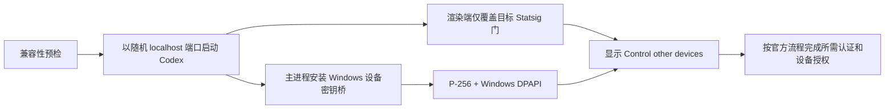

# Codex Control other devices for Windows

[English](README.en.md) | 简体中文

在 Windows 版 Codex Desktop 中启用已经随应用打包、但因运行时缺陷无法正常出现的：

**设置 → 连接 → 控制其他设备（Control other devices）**

本项目不会修改 `ChatGPT.exe`、`app.asar`，也不会改写
`C:\Program Files\WindowsApps` 中的任何文件。修复只在通过本项目启动的当前 Codex
进程中生效；正常启动 Codex 即可停用。

> [!IMPORTANT]
> 设备注册时，请完成账号或工作区要求的 MFA、SSO 或 passkey 验证。本次测试账号
> 要求预先启用 MFA；如果授权流程提示 MFA，请先完成设置再开始设备注册。

> [!WARNING]
> 这是非官方、与客户端内部实现相关的运行时兼容方案。它会在随机的
> `127.0.0.1` 端口启用 Chromium 调试接口。只应在可信 Windows 电脑上运行，
> 并应在每次 Codex 更新后重新执行兼容性检查。

## 当前验证状态

| 项目 | 结果 |
|---|---|
| Windows | Windows 11，已通过 |
| Codex Desktop | `26.721.4979.0`，已完成端到端验证 |
| Node.js | `22.23.1`，已通过 |
| 功能 | 标签显示、控制器授权、设备列表、远程项目均可使用 |
| 安装包修改 | 无 |

hunterbeach 的原始研究记录验证过 `26.715.7063.0`。本仓库不只检查版本号，还会
扫描本机 `app.asar` 中四个与该缺陷相关的文本哨兵，并检查原生模块是否存在。这是
针对已测试代码族的**启发式兼容检查**，可以拦截许多不匹配更新，但不能替代对新
版本控制流的人工审计。

## 解决了什么问题

受影响的 Windows 安装包同时具备以下状态：

1. Windows 控制其他设备所需的页面、文案和后端调用已经随包提供。
2. Statsig 门 `782640499` 在渲染端的使用逻辑与名称语义相反，门值为 `true`
   时反而隐藏 `showControlOtherDevices`。
3. 主进程设备密钥入口仍只允许 `process.platform === "darwin"`。
4. Windows 包没有随附 `remote-control-device-key.node`。

所以会出现一个很具体的症状：Windows 可以显示“控制此电脑”和“SSH”，手机或
平板也可以控制这台电脑，但 Windows 端没有“控制其他设备”标签，无法把这台电脑
注册成控制器。

官方的 [Remote connections 文档](https://learn.chatgpt.com/docs/remote-connections)
介绍了正常的设备配对、同账号/工作区、所需身份验证和远程主机要求。本项目只补齐
受影响 Windows 构建中的本地运行时缺口，不绕过账号授权、MFA/SSO/passkey、
工作区策略或服务端权限。

## 本项目的实现特点

- **不修改安装包**：不复制、解包后替换或重新签名 Codex 文件。
- **启发式兼容性预检**：扫描实际安装包中的四个缺陷文本哨兵，并检查 Windows
  原生模块是否已经由官方提供；新版本仍需人工复核。
- **最小范围覆盖**：只覆盖目标 Statsig 门、目标原生模块加载，以及基于
  `getAddon` 栈名称匹配的平台判断。
- **Windows 密钥保护**：生成 P-256 设备密钥，私钥写盘前使用 Windows DPAPI
  `CurrentUser` 加密。
- **兼容旧存储**：可以读取 hunterbeach 运行时实验产生的旧格式密钥文件。
- **随机回环端口**：每次启动自动选择空闲的 `127.0.0.1` 端口，减少冲突。
- **缩短主进程暴露**：注入完成后关闭并探测 Electron 主进程 Inspector；关闭验证
  失败时自动恢复普通启动。
- **失败自动回滚**：任一注入探针失败，特殊启动会终止并自动恢复为普通 Codex
  启动。
- **可恢复清理**：清理脚本默认不碰密钥；可选操作也只是把密钥文件移动到带时间戳
  的备份，而不是永久删除。

## 工作流程



## 使用要求

- Windows 10 或 Windows 11。
- 从 Microsoft Store/MSIX 安装的 `OpenAI.Codex`。
- Node.js 22 或更新版本，且 `node.exe` 在 `PATH` 中。
- 能够完成账号/工作区要求的 MFA、SSO 或 passkey；本次测试账号要求 MFA。
- 另一台使用同一账号和工作区登录、在线并允许 Remote Control 的 Codex 主机。
- 当前电脑可信，没有不受信任的同用户进程。

检查 Node.js：

```powershell
node --version
```

## 快速开始

### 1. 下载

```powershell
git clone https://github.com/naipi11/Codex-Control-other-devices-Windows.git
cd Codex-Control-other-devices-Windows
```

### 2. 先执行只读预检

```powershell
powershell -NoProfile -ExecutionPolicy Bypass `
  -File .\Test-CodexControlOtherDevices.ps1
```

只有看到以下三项满足时才继续：

- `Ready: True`
- Node.js 版本不低于 22
- `Heuristic match: True`

### 3. 保存工作并启动修复

启动器会关闭当前 Codex Desktop，然后立即重新打开。请先保存未提交的输入或其他
前台工作。

```powershell
powershell -NoProfile -ExecutionPolicy Bypass `
  -File .\Start-CodexControlOtherDevices.ps1
```

成功后会看到：

```text
Codex Control other devices is enabled for this app session.
Open Settings > Connections > Control other devices.
```

### 4. 完成设备授权

1. 打开 **设置 → 连接 → 控制其他设备**。
2. 选择 **添加/设置**。
3. 使用同一 ChatGPT 账号完成流程要求的 MFA、SSO 或 passkey 验证。
4. 确保目标 Mac/Windows 主机在线，并启用了“允许其他设备连接”。
5. 新建项目时，在 **New remote project** 中选择目标设备。

## 每次都需要这样启动吗？

是。覆盖只存在于本次特殊启动的进程内：

- 通过 `Start-CodexControlOtherDevices.ps1` 启动：功能生效。
- 从开始菜单、任务栏或 Microsoft Store 正常启动：功能不生效，调试端口也不会打开。

这种设计避免修改受 Microsoft Store 保护和签名的应用文件，也提供了最直接的停用
方式。

如果需要快捷方式，可以把快捷方式目标设置为：

```text
powershell.exe -NoProfile -ExecutionPolicy Bypass -File "完整路径\Start-CodexControlOtherDevices.ps1"
```

更新仓库或 Codex 后，先重新运行预检。

## 安全模型

### 调试端口

- 渲染端调试端口只绑定随机的 `127.0.0.1` 地址。
- 主进程 Inspector 同样只绑定 `127.0.0.1`。启动成功的前提是脚本已经确认该端口
  关闭；若未关闭，启动器会停止特殊实例并恢复普通启动。
- 在关闭前的短暂窗口内，Node Inspector 具有执行主进程代码的能力，这也是只应在
  可信电脑上运行的原因之一。
- Chromium 渲染端调试端口会一直存在到 Codex 退出。与当前 Windows 用户同权限的
  恶意进程可能利用它执行渲染端代码，因此不要在不可信电脑上使用。

### 设备私钥

设备私钥保存在：

```text
%CODEX_HOME%\remote-control-device-keys.windows.json
```

未设置 `CODEX_HOME` 时，默认路径为
`%USERPROFILE%\.codex\remote-control-device-keys.windows.json`。

私钥使用 Windows DPAPI `CurrentUser` 范围加密。其他 Windows 用户不能直接用该
密文完成签名，但登录到同一 Windows 用户会话的恶意程序仍属于信任边界内。

为了兼容 Codex 的设备密钥协议，桥接层报告
`os_protected_nonextractable`。本实现是 DPAPI 保护的软件密钥，**不等同于 TPM 或
Secure Enclave 中真正不可导出的硬件密钥**。

更多信息见 [SECURITY.md](SECURITY.md)。

## 停用与回滚

### 最简单的停用方法

退出 Codex，然后从开始菜单正常启动。运行时覆盖和调试端口都会消失，安装包无需
恢复。

### 使用回滚脚本

停止特殊实例并正常重启 Codex，但保留设备密钥：

```powershell
powershell -NoProfile -ExecutionPolicy Bypass `
  -File .\Reset-CodexControlOtherDevices.ps1
```

如果你已经先在 Codex 中撤销了该控制器的访问权限，还可以把本地加密密钥文件移动
到可恢复备份：

```powershell
powershell -NoProfile -ExecutionPolicy Bypass `
  -File .\Reset-CodexControlOtherDevices.ps1 `
  -BackupDeviceKeyStore
```

该参数不会永久删除文件，脚本会显示实际备份路径。移动本地密钥文件本身不会撤销
服务端授权，所以正确顺序是：**先在 Codex 中撤销，再备份/移走本地文件**。

## 诊断与日志

日志默认写入：

```text
%TEMP%\CodexControlOtherDevices\runtime-YYYYMMDD-HHMMSS.log
%TEMP%\CodexControlOtherDevices\last-session.json
```

日志包含客户端版本、随机本地端口和注入探针结果，不应包含账号密码或设备私钥。
公开提交日志前仍应检查其中的本机路径和其他环境信息。

## 常见问题

### 仍然没有“控制其他设备”标签

1. 确认是通过本仓库启动器打开的 Codex。
2. 重新运行预检，确认 `Ready: True`。
3. 查看最新的 `%TEMP%\CodexControlOtherDevices\runtime-*.log`。
4. 确认没有安全软件阻止 `node.exe` 访问本机回环端口。
5. 退出所有 Codex 进程后重试。

### 更新 Codex 后预检失败

这是预期的保护行为。更新可能已经修复缺陷，也可能改变内部标识符或调用契约。
哨兵检查本身也不能证明未来版本兼容。不要为了“先跑起来”而删除检查；请提交
Issue，并附上：

- Codex 包版本；
- 预检中的布尔文本哨兵结果；
- 已脱敏的错误信息。

不要上传 `app.asar`、登录令牌或设备密钥。

### 点击“添加”后授权失败

- 完成账号或工作区提示的 MFA、SSO 或 passkey；如果提示必须预先启用 MFA，请在
  重新开始设备注册前完成。
- 确认 Codex 与浏览器使用相同的 ChatGPT 账号和工作区。
- 如果是组织工作区，请确认管理员允许 Remote Control。

### 看不到其他设备

- 目标设备必须使用同一账号和工作区。
- 目标 Codex Desktop 必须在线、保持唤醒并允许其他设备连接。
- 退出登录会关闭 Remote Control；重新登录后需要重新打开开关。

### Node.js 不满足要求

安装 Node.js 22 或更新版本，重新打开 PowerShell，并确认：

```powershell
Get-Command node.exe
node --version
```

## 项目结构

```text
.
├── Start-CodexControlOtherDevices.ps1   # 预检、重启、注入、失败回滚
├── Test-CodexControlOtherDevices.ps1    # 只读兼容性检查
├── Reset-CodexControlOtherDevices.ps1   # 停用与可恢复密钥备份
├── src/
│   ├── check-package.mjs                # 流式扫描 app.asar 文本哨兵
│   └── runtime/                         # 隔离 clean-room 运行时实现
│       ├── orchestrator.js              # 主/渲染端安装与关闭验证
│       ├── main-payload.js              # Windows DPAPI 设备密钥桥
│       ├── renderer-payload.js          # Statsig 目标门控覆盖
│       └── lib/cdp.js                   # 无依赖 CDP/WebSocket 传输
├── tests/
│   ├── Validate.ps1                     # 仓库、运行时与包哨兵验证
│   └── CleanroomSelfTest.js             # DPAPI/兼容/渲染/端口自测
├── docs/
│   ├── TECHNICAL.md                     # 技术设计与信任边界
│   └── CLEANROOM.md                     # 隔离实现记录与边界
├── package.json                         # Node 版本约束与验证命令
├── SECURITY.md
├── NOTICE.md
└── LICENSE
```

## 开发验证

```powershell
powershell -NoProfile -ExecutionPolicy Bypass `
  -File .\tests\Validate.ps1
```

验证内容包括：

- 所有 PowerShell 文件语法；
- 所有 JavaScript/ESM 文件的 Node.js 语法；
- 临时目录中的 DPAPI 密钥全生命周期、旧存储兼容、Statsig 覆盖与 Inspector 关闭自测；
- 仓库必需文档；
- 本机已安装 Codex 的缺陷哨兵预检。

## 原创贡献与来源边界

本仓库根据 hunterbeach 公布的问题定位和运行时技术路线定义功能契约，并结合对本机
Codex Desktop `26.721.4979.0` 安装包的只读检查与端到端验证。为避免把没有明确开源
许可的上游实现文本混入 MIT 代码，本仓库最终发布的 `src/runtime` 核心采用隔离的
**clean-room 独立重写**：实现者只能看到所需行为、接口字段和本机包中的公开调用契约，
不能查看前期衍生原型、原始 Gist 代码或其他在线 workaround 源码。过程与测试记录见
[docs/CLEANROOM.md](docs/CLEANROOM.md)。

属于本仓库的主要原创工程贡献包括：

- 无外部依赖的安装包流式文本哨兵扫描；
- 随机回环端口与主 Inspector 关闭验证；
- 不匹配构建拒绝运行和失败自动恢复普通启动；
- 带版本结构、旧格式兼容和可恢复清理的 DPAPI 密钥存储；
- 经过隔离重写、无运行时依赖的 CDP/Inspector 桥接代码；
- 中英双语文档、安全边界和自动验证。

核心问题定位与运行时注入方法来自 hunterbeach 的
[Codex Windows runtime remote control Gist](https://gist.github.com/hunterbeach/dc4b74bda0e045e33f308099182b4f80)
。该 Gist 还注明其主进程思路来源于
[zdaar/codex-hacks](https://github.com/zdaar/codex-hacks/blob/main/patch_codex_remote_control.py)，
渲染端注入模式参考了
[brunolemos 的 feature-override Gist](https://gist.github.com/brunolemos/7466058059eae140a57a7c6a42f235ae)。
本项目明确区分“上游发现与技术路线”和“本仓库独立代码表达及新增工程”，不把他人
成果表述为自己的原创发现，也不复制缺少明确许可证的上游源码。完整来源边界见
[NOTICE.md](NOTICE.md)。

本仓库不分发 OpenAI 的程序文件或资源，也不隶属于 OpenAI。

## 许可证

[MIT](LICENSE) © 2026 naipi11。MIT 许可覆盖本仓库新增代码与文档；上游项目和公开
技术材料仍适用各自的权利与许可条款，参见 [NOTICE.md](NOTICE.md)。
